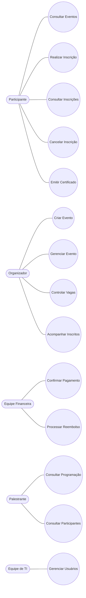
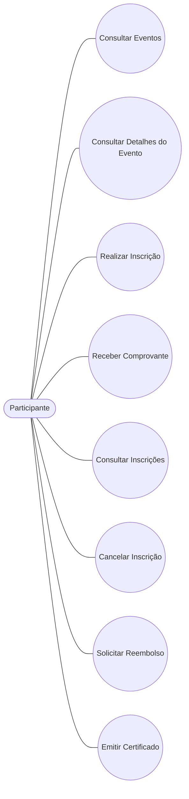
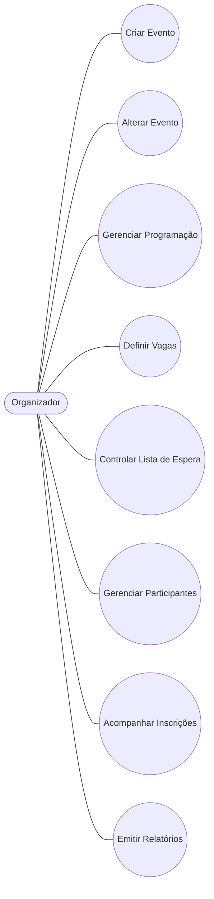
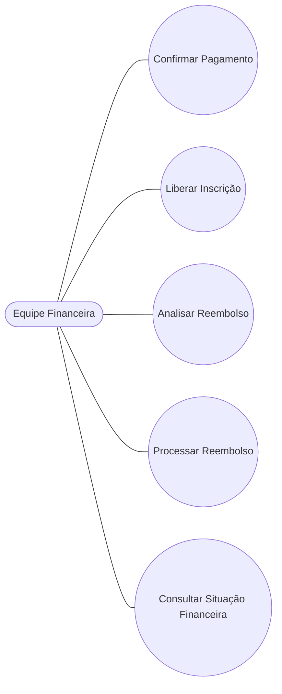
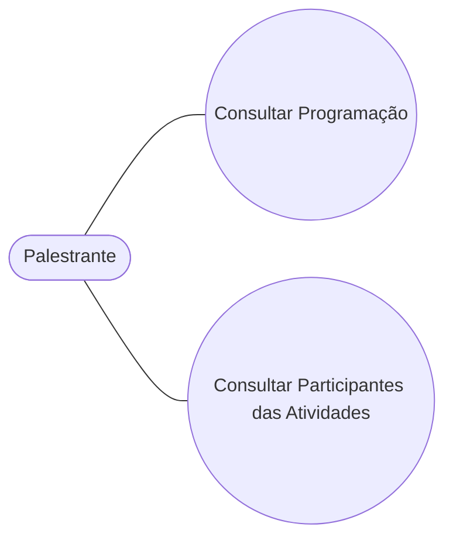
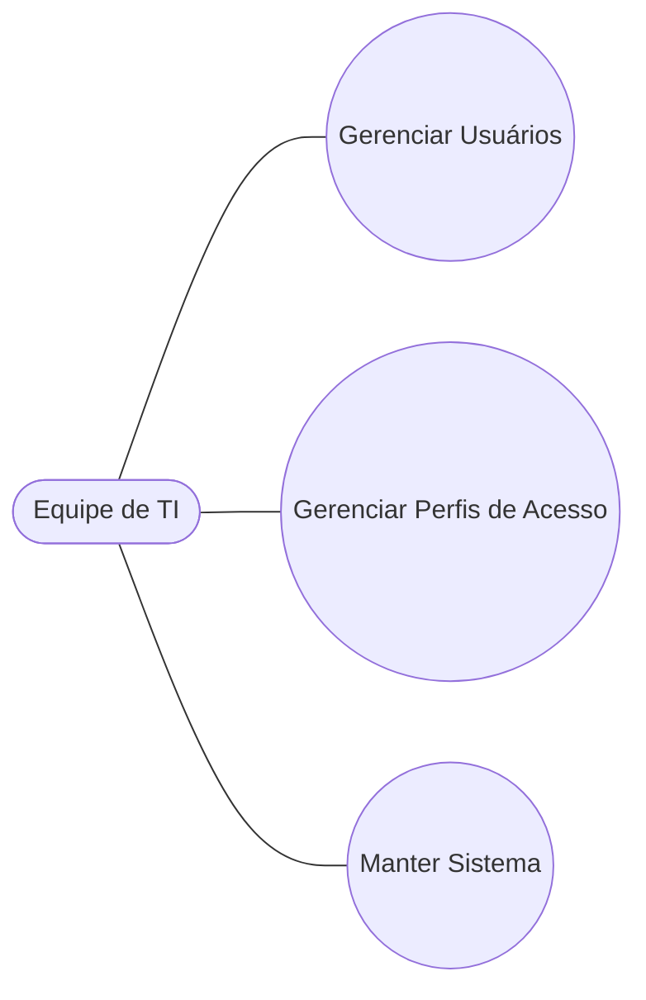

# Atividade 5 - Diagramas de Casos de Uso

# Sistema de Gestão de Eventos - Eventus

## Objetivo

Representar graficamente os principais casos de uso identificados durante a elicitação e análise dos requisitos do Sistema de Gestão de Eventos da Eventus.

---

# Diagrama Geral de Casos de Uso

---

# Diagrama de Casos de Uso - Participante

---

# Diagrama de Casos de Uso - Organizador

---

# Diagrama de Casos de Uso - Equipe Financeira

---

# Diagrama de Casos de Uso - Palestrante

---

# Diagrama de Casos de Uso - Equipe de TI

---

# Relacionamento dos Casos de Uso com os Requisitos Funcionais

| Caso de Uso | Requisitos Relacionados |
|-------------|-------------------------|
| Consultar Eventos | RF01, RF02 |
| Realizar Inscrição | RF03, RF04 |
| Emitir Comprovante | RF05 |
| Consultar Inscrições | RF06 |
| Cancelar Inscrição | RF07 |
| Emitir Certificado | RF08 |
| Criar Evento | RF09 |
| Alterar Evento | RF10 |
| Gerenciar Programação | RF11 |
| Controlar Vagas | RF12, RF13, RF14 |
| Lista de Espera | RF15 |
| Configurar Cancelamento | RF16 |
| Acompanhar Inscrições | RF17 |
| Gerenciar Participantes | RF18 |
| Relatórios | RF19 |
| Confirmar Pagamento | RF21, RF22, RF23 |
| Reembolso | RF24, RF25 |
| Situação Financeira | RF26 |
| Consultar Programação | RF27 |
| Consultar Participantes | RF28 |
| Gerenciar Usuários | RF30, RF31, RF32 |

---

# Conclusão

Foram modelados os diagramas de casos de uso para todos os stakeholders identificados no projeto Eventus, permitindo visualizar as principais interações entre usuários e sistema e servindo como base para a próxima etapa de especificação detalhada dos casos de uso.
